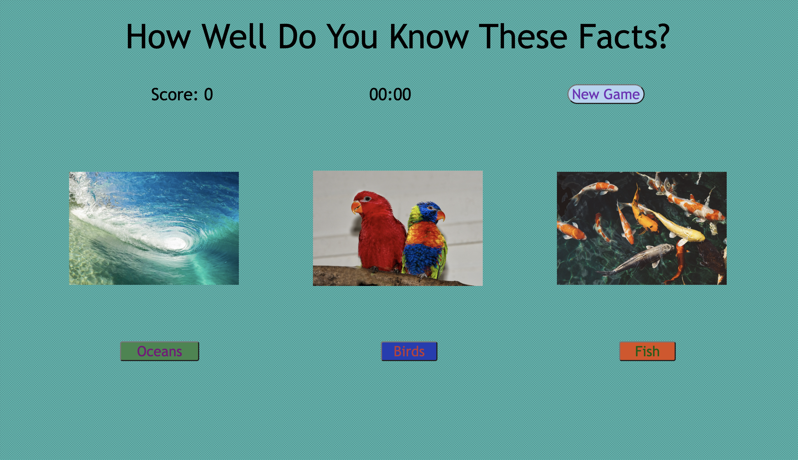

# Fun Fact Quiz Game

## How Well Do You Know These Facts?
Description: Fun Facts Quiz Game is a game created for children to have fun while they learn. Over 60 fun facts with a great selection of categories to choose from. 

* The reason I chose this game because I wanted to create a way for children to learn but in fun way. It's not just a game that can be played alone you are able to sit with a friend and try to figure out the correct answers and that allows for more than one person to gain knowledge.

## Getting Started:
Click to play the game: https://fun-fact-quiz-game.netlify.app/
 
 * Rules of the Game:

 1. At the start of the game the player is given 3 categories: Oceans, Birds, & Fish.

2. The player picks a category and the timer begins to count down from 40 seconds giving them only 40 seconds to answer all 10 fun facts.

3. The player is able to gain points if they get the answer correct or receive no points if they answer incorrectly. 

4. When the timer goes off the player  will be told if they won the game or not. If they get all 10 of the fun facts correct they won but if they have scored less than 10 they lost.

4. The player now has the opportunity to click the reset button to refresh the game and play another round.

## Planning Materials Link: 
https://docs.google.com/document/d/1xlyt8k80uL8ruvw8gmAkv7gmJPL6QPHAuEeivT9yHus/edit?usp=sharing

## Attributions: 
1. https://freesound.org/
2. https://heropatterns.com/
3. https://pixabay.com/

## Technologies Used: 
1. JavaScript
2. CSS
3. HTML

## Future Plans For The Game:
- Add 7 more categories to the game
- Go more in depth with the fun facts
- Add difficulty levels to the game
- Add audio function restart button
- Add more CSS styling